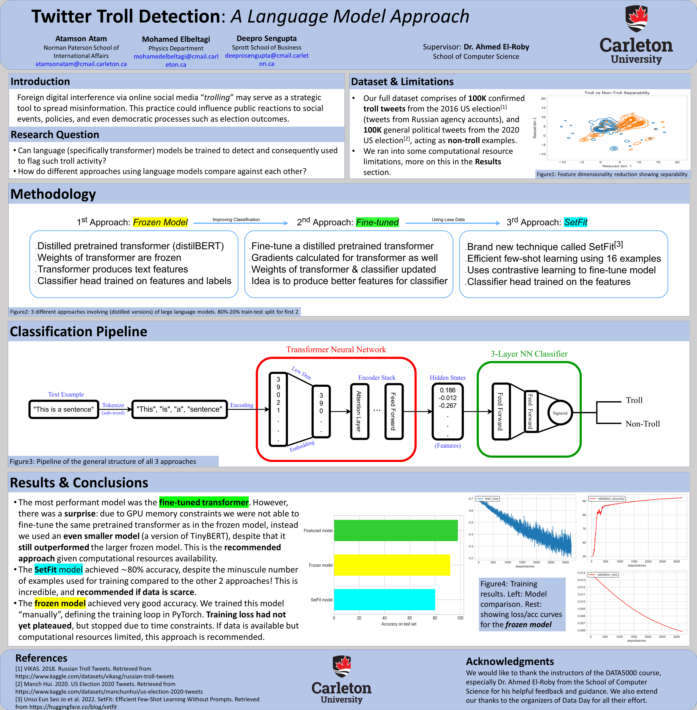

# Twitter_Troll_Detection
This is the code for a text classification project that aims to distinguish real tweets from "troll" tweets (or rather tweet-farm generated political tweets sponsored by foreign actors). We take a transfer learning approach in general, 3 models were used to compare their performance. (1) A distilled version of a pretrained LLM with fixed weights for encoding the text, and a binary classification head trained on top of it. (2) A pretrained smaller version of a LLM now its weights adjustable by the training process to be finetuned, along with a binary classification head. (3) and finally a new few-shot learning (without prompts) technique called SetFit (https://huggingface.co/blog/setfit) that dramatically decreases the number of examples needed for training by using contrastive learning. The models were trained using 2 political tweets datasets, one confirmed to be russian-troll generated (https://www.kaggle.com/datasets/vikasg/russian-troll-tweets), and one containing 2020 election tweets, while excluding foreign/ and non-english language tweets (https://www.kaggle.com/datasets/manchunhui/us-election-2020-tweets).
A full report on the project is currently being written, and will be posted when finished.
Poster has been posted, see below for a brief overview of the project. The **_poster won 3rd place at the Carleton Data Day 9.0 poster competition_**.

